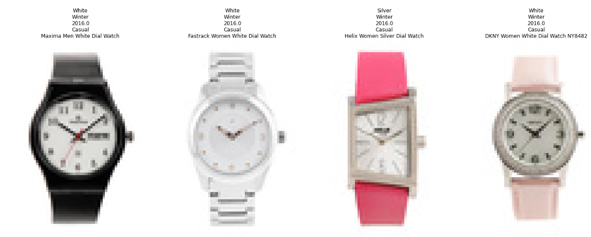

# Desafio: Sistema de Recomendação por Imagens Digitais

## Descrição do Desafio

O objetivo deste projeto foi desenvolver um sistema de recomendação de produtos baseado em imagens. Em vez de recomendar produtos relacionados com base em dados textuais (como preço, modelo, marca ou loja), o sistema utiliza a aparência física das imagens (formato, cor, textura, etc.) para encontrar itens semelhantes. 

Para este sistema, treinamos uma rede de Deep Learning com várias classes de objetos, como relógios, camisetas, bicicletas e sapatos. Dentro de cada classe, os objetos devem ser similares em aparência.

## Solução Implementada

### 1. Instalação de Dependências

Instalamos as bibliotecas necessárias para o desenvolvimento, incluindo TensorFlow, Keras, OpenCV, scikit-learn, matplotlib e Faiss.

### 2. Carregamento e Pré-processamento das Imagens

Organizamos as imagens em uma estrutura de diretórios com subdiretórios para cada classe de objeto. Utilizamos uma função para carregar e pré-processar as imagens para garantir que estivessem no formato correto para o treinamento do modelo.

### 3. Treinamento da Rede Neural

Utilizamos o modelo VGG16 pré-treinado, removendo a camada de saída e adicionando camadas densas para classificação. Compilamos e treinamos o modelo com as imagens das diferentes classes, dividindo os dados em conjuntos de treino e teste.

### 4. Extração de Características e Indexação com Faiss

Após o treinamento, extraímos características das imagens usando o modelo treinado e utilizamos a biblioteca Faiss para criar um índice de vetores. Isso nos permitiu buscar de maneira eficiente as imagens mais semelhantes com base nas características extraídas.

### 5. Sistema de Recomendação

Desenvolvemos uma função de recomendação que carrega uma imagem de consulta, extrai suas características e encontra as imagens mais similares no índice Faiss. A função exibe a imagem de consulta e as imagens recomendadas.

## Exemplo de Recomendação

Abaixo está um exemplo de imagem de consulta e suas imagens recomendadas com base na similaridade visual.

---

Este projeto demonstra a aplicação prática de técnicas de visão computacional para criar um sistema de recomendação visualmente intuitivo e eficaz. Utilizando modelos de deep learning e indexação de vetores, conseguimos desenvolver um sistema que fornece recomendações precisas baseadas na aparência física dos produtos.

